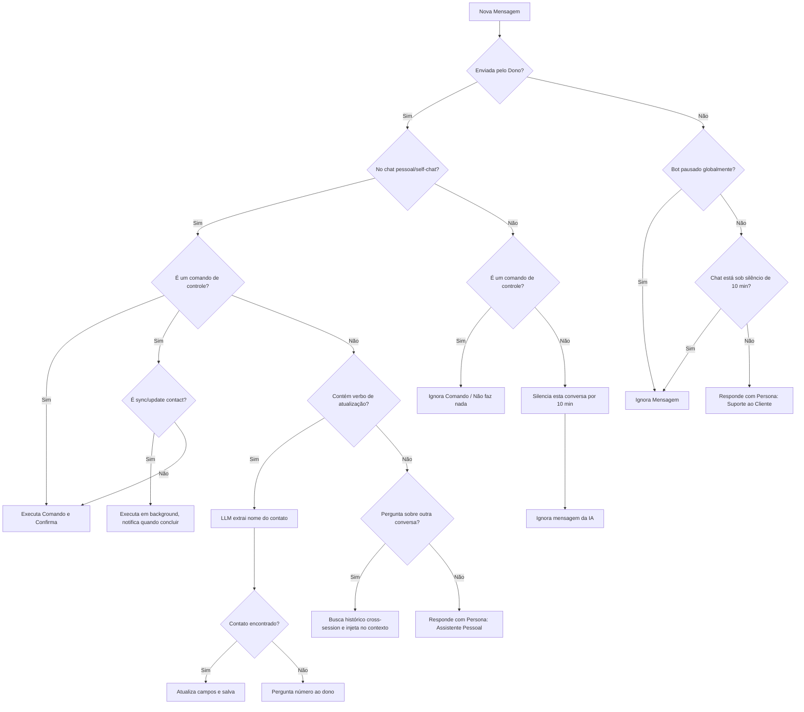

# 📐 Arquitetura e Regras de Controle do Chatbot (WhatsApp)

Este documento descreve as diretrizes arquiteturais, o funcionamento dos comandos de controle e a regra de silenciamento temporário do chatbot do WhatsApp para evitar conflitos de comportamento e garantir total clareza.

---

## 1. 🎛️ Pausa Global (Controlada na Ponte)

O chatbot possui um mecanismo de pausa global que suspende o atendimento automático para **todos os clientes**. Ele **não afeta** as mensagens enviadas pelo dono na sua conversa pessoal com o bot (o assistente pessoal continua respondendo o dono normalmente).

* **Comandos:** `stop_bot` / `start_bot` (e seus sinônimos como `!pausar`, `!retomar`, `!parar`, `!iniciar`).
* **Escopo:** Nível Node.js (`bridge.js`). O status é persistido no arquivo `bot_state.json`.
* **Restrição de Execução:** Estes comandos **só funcionam se forem enviados pelo dono dentro da sua própria conversa pessoal/self-chat** com o bot. Digitar `start_bot` ou `stop_bot` na conversa de um cliente não fará nada.
* **Comportamento:** Ao pausar, a ponte descarta na origem as mensagens recebidas de qualquer pessoa que não seja o dono. O plugin Python também verifica esse estado no boot e desvia o fluxo se o bot estiver pausado.

---

## 2. 🔇 Silenciamento Temporário (Conversas Específicas com Clientes)

O silenciamento serve para que o bot **não interfira** quando o dono decide falar diretamente ou ler a conversa de um cliente específico. Ele funciona de forma 100% individualizada.

* **Duração:** 10 minutos (configurável em `WHATSAPP_SILENCE_DURATION_MIN` no `.env`).
* **Escopo:** Apenas o chat do cliente em questão. O bot continua ativo para os outros clientes e no chat pessoal do dono.
* **Gatilhos de Ativação:**
  1. **Visualização:** O dono abre/lê a conversa do cliente em qualquer dispositivo conectado (mobile ou web) — detectado via `chats.update` quando o número de não lidas cai para `0` ou `-1`.
  2. **Mensagem Manual:** O dono envia qualquer mensagem manual para o cliente — detectado via `fromMe: true` em mensagens que não foram enviadas pela própria IA (ou seja, não estão em `recentlySentIds`).
* **Restrição de Comandos:** Mensagens enviadas pelo dono que começam com `!` ou são comandos específicos (como `start_bot`/`stop_bot`) são ignoradas pelo gatilho e **não silenciam o chat**.

---

## 🔄 Fluxo de Processamento (Resumo Técnico)

---

## 3. 🔍 Detecção Cross-Session (Self-Chat)

Quando o dono pergunta sobre uma conversa com outro contato, o plugin detecta o nome via regex + stopwords em `pre_llm_call`, busca o histórico em `whatsapp_messages.db` e `state.db`, e injeta no contexto antes da chamada ao LLM.

---

## 4. 📇 Atualização de Contatos em Linguagem Natural

Detectada em `pre_gateway_dispatch` quando a mensagem do dono contém verbos de atualização (atualizar, mudar, registrar, etc.). O LLM extrai o nome do contato e os campos mencionados. Atualização é persistida em `personal_contacts.json` e sincronizada com GitHub. Campos auto-gerados (`tone`, `summary`, `guidelines`) não são sobrescritos por updates manuais.

---

## 5. 📊 Resumo Cumulativo (`full_summary`)

Processado a cada sync a partir do `state.db`. Apenas mensagens do contato (`role=user`) são incluídas. O LLM incrementa o `full_summary` com cada sessão nova, acumulando o histórico por período. Quando longo, é comprimido em `summary` de 1-2 frases para uso no contexto de atendimento.

---

## 6. ⚡ Sync Não-Bloqueante

O sync de contatos roda sempre em thread daemon via `_run_sync_in_background`. O bot permanece disponível durante o processo. Não há sync automático no boot — apenas no intervalo periódico (`WHATSAPP_SYNC_INTERVAL_HOURS`) ou quando solicitado via chat.

